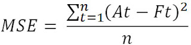

# LAPORAN PROYEK MACHINE LEARNING - TRI RAMDHANY
## Latar Belakang
 Pasar cryptocurrency telah mengalami pertumbuhan pesat dalam beberapa tahun terakhir, dengan semakin banyaknya jenis aset digital yang diperkenalkan dan diperdagangkan. Salah satu aset yang menonjol adalah Solana (SOL), sebuah cryptocurrency yang dikenal dengan kemampuan skalabilitas tinggi dan kecepatan transaksi yang unggul. Sebagai salah satu dari 10 besar cryptocurrency berdasarkan kapitalisasi pasar, Solana menarik perhatian baik dari investor ritel maupun institusional.
 
Namun, volatilitas tinggi yang menjadi ciri khas cryptocurrency, termasuk Solana, membuat proses pengambilan keputusan investasi menjadi tantangan. Fluktuasi harga yang signifikan sering kali dipengaruhi oleh berbagai faktor, seperti sentimen pasar, adopsi teknologi, kebijakan pemerintah, dan dinamika pasar global. Dalam konteks ini, kemampuan untuk memprediksi harga Solana secara akurat menjadi sangat berharga bagi investor, pedagang, dan analis pasar.

Teknologi kecerdasan buatan dan pembelajaran mesin (machine learning) telah terbukti menjadi alat yang efektif dalam menganalisis data kompleks dan memprediksi tren masa depan. Dengan memanfaatkan algoritma prediktif, model dapat dilatih untuk mengidentifikasi pola-pola yang tersembunyi dalam data historis dan memberikan estimasi harga di masa depan. Pendekatan ini tidak hanya membantu mengurangi risiko dalam perdagangan, tetapi juga memberikan wawasan berharga tentang faktor-faktor utama yang memengaruhi pergerakan harga Solana.

Proyek ini bertujuan untuk mengembangkan model prediktif harga Solana menggunakan data historis pasar, termasuk harga, volume perdagangan, serta indikator teknis dan fundamental. Hasil penelitian ini diharapkan dapat memberikan kontribusi signifikan dalam pemahaman dan pengelolaan risiko dalam investasi cryptocurrency, khususnya Solana, di tengah dinamika pasar yang terus berkembang.

### Referensi
-**[Survey on Cryptocurrency Price Prediction Using Machine Learning](https://www.ijres.org/papers/Volume-10/Issue-2/Ser-3/G10124247.pdf)**

## Business Understanding
### Problem Statement
Pasar cryptocurrency, termasuk Solana (SOL), memiliki sifat yang sangat volatil dan kompleks dengan pola pergerakan harga yang dipengaruhi oleh berbagai faktor seperti sentimen pasar, tren keuangan global, dan indikator teknikal. Kompleksitas ini menyulitkan prediksi harga yang akurat, padahal prediksi yang andal sangat penting bagi para investor dan trader untuk membuat keputusan yang tepat.

Meskipun terdapat data historis yang melimpah mengenai pergerakan harga Solana, pendekatan prediksi yang ada sering kali gagal menangkap pola rumit dan sifat non-stasioner dari pasar cryptocurrency. Model statistik tradisional cenderung kurang mampu menggeneralisasi hubungan yang kompleks, sementara penerapan model machine learning yang lebih canggih pada pasar Solana masih terbatas atau kurang dioptimalkan

### Goal
Penelitian ini bertujuan untuk mengembangkan model prediktif berbasis machine learning yang mampu memprediksi harga Solana (SOL) secara akurat dengan cara berikut:
1. Membangun Model Prediksi yang Optimal

Menggunakan algoritma machine learning seperti Support Vector Regression (SVR), Random Forest (RF), k-Nearest Neighbors (KNN), dan XGBoost untuk membangun model prediksi.
Melakukan tuning hyperparameter menggunakan metode seperti Grid Search untuk meningkatkan akurasi prediksi.

2. Mengevaluasi Performa Model

Membandingkan performa model dengan metrik evaluasi seperti Mean Squared Error (MSE

### Solution Statement
Solusi yang dapat diterapkan agar goals diatas terpenuhi adalah sebagai berikut:

Melakukan analisa pada data untuk dapat memahami data yang ada dengan menerapkan teknik visualisasi data. Analisa yang dapat dilakukan yaitu, Memeriksa korelasi antar data penting untuk memahami hubungan data target dan data fitur.

Melakukan pemrosesan pada data seperti:

1.Mengatasi outlier pada data dengan menerapkan IQR method.

2.Normalisasi data pada fitur numerik.

Membangun model regresi yang dapat memprediksi bilangan kontinu sesuai dengan permasalahan yang ingin di selesaikan. Beberapa algoritma yang akan digunakan pada model regresi proyek ini yaitu, sebagai berikut:

-Support Vector Machine

-K-Nearest Neighbours

-Random Forest

-XGBoost

Menerapkan teknik Grid Search untuk mendapatkan parameter-parameter dengan performa terbaik pada masing-masing model.

### Data Understanding
Dataset yang di gunakan pada proyek machine learning ini merupakan Dataset yang menyediakan riwayat harga harian Solana dari tahun 2020 - 2022. Dataset tersebut dapat di unduh di website kaggle: **[Solana Data](https://www.kaggle.com/datasets/varpit94/solana-data)**

Setelah dilakukan analisa pada data, didapatkan informasi bahwa:

-Format dataset yaitu CSV (Comma-Seperated Values)

-Jumlah kolom data yang terdapat didalam dataset berjumla 7 kolom, antara lain: Date, Open, High, Low, Close, Adj Close, Volume

-Terdapat 715 jumlah sample yang terdapat didalam dataset.

-Terdapat 5 kolom data yang memiliki tipe data Float yaitu (High, Low, Open, Close, adj close).

-Terdapat 1 kolom data yang memiliki tipe data Integer yaitu (Volume)

-Terdapat 2 kolom data yang memiliki tipe data Object atau String yaitu (Date)

-Tidak terdapat missing value pada dataset

### Variabel-variabel pada dataset adalah sebagai berikut:

-Date: Tanggal pencatatan data

-High : Harga tertinggi pada hari tertentu

-Adj High : Copy harga tertinggi pada hari tertentu

-Low : Harga terendah pada hari tertentu

-Open : Harga pembukaan pada hari tertentu

-Close : Harga penutupan pada hari tertentu

-Volume : Volume transaksi pada hari tertentu

Sebelum melakukan pemrosesan data untuk pelatihan, perlu dilakukan analisa pada data untuk mengetahui keadaan pada data seperti korelasi antar fitur dan outlier pada data. Berikut visualisasi data yang menunjukkan korelasi atar fitur dan outlier pada data:

1.Menangani Oulier
Jika dilihat divisualisasi outlier dibawah hampir semua data numeric memiliki data outlier. Terdapat beberapa teknik untuk mengatasi outlier pada data. Pada proyek ini akan menerapkan teknik IQR Method yaitu dengan menghapus data yang berada diluar interquartile range. Interquartile merupakan range diantara kuartil pertama(25%) dan kuartil ketiga(75%).
	
 
2.Multivariate Analysis
Jika di lihat dari visualisasi data dibawah. Fitur Close pada sumbu y memiliki korelasi dengan data pada fitur High, Low, Open, dan adj_close. Korelasi yang terdapat pada data-data tersebut merupakan korelas yang tinggi, sedangkan untuk fitur Volume terlihat memiliki korelasi yang cukup lemah karena sebaran datanya tidak membentuk pola

## Data Preparation

Berikut merupakan tahapan dalam mempersiapkan data untuk keperluan pelatihan model:

### Menghapus data yang tidak diperlukan dan merubah nama column
Kolom data seperti (Date, Adj Close, Value) tidak diperlukan untuk pelatihan, karena data tersebut akan mengganggu model dalam mempelajari data. Karena isi dari data tersebut tidak memiliki value yang berarti untuk dipelajari oleh model. Lalu, mengubah nama kolom High, Low, Open, Close menjadi nama kolom yang dapat lebih dipahami
| From        | to	    |
| ----------- | ----------- |
| High        | High_Price  |
| Low	      | Low_Price   |
| Open        | Open_Price  |
| Close	      | Close_Price |

## Split dataset
Membagi dataset menjadi data latih (train) dan data uji (test) merupakan hal yang harus kita lakukan sebelum membuat model.Data latih adalah sekumpulan data yang akan digunakan oleh model untuk melakukan pelatihan. Sedangkan, data uji adalah sekumpulan data yang akan digunakan untuk memvalidasi kinerja pada model yang telah dilatih. Karena data uji berperan sebagai data baru yang belum pernah dilihat oleh model, maka cara ini efektif untuk memeriksa performa model setelah proses pelatihan dilakukan. Proporsi pembagian dataset pada proyek ini menggunakan proporsi pembagian 80:20 yang berarti sebanyak 80% merupakan data latih dan 20% persen merupakan data uji.

## Normalisasi data
Melakukan transformasi pada data fitur fitur yang akan dipelajari oleh model menggunakan library MinMaxScaler. MinMaxScaler mentransformasikan fitur dengan menskalakan setiap fitur ke rentang tertentu. Library ini menskalakan dan mentransformasikan setiap fitur secara individual sehingga berada dalam rentang yang diberikan pada set pelatihan, pada library ini memiliki range default antara 0 dan 1. Dengan merenapkan teknik normalisasi data, model akan dengan lebih mudah mengenali pola-pola yang terdapat pada data sehingga akan menghasilkan prediksi yang lebih baik daripada tidak menggunakan teknik normalisasi.

## Modeling
Algoritma machine learning yang digunakan pada proyek ini yaitu Support Vector Regression, K-Nearest Neighbours, Random Forest, XGBoost.

## Support Vector Regression (SVR)

Support Vector Regression (SVR) menggunakan prinsip yang sama dengan SVM pada kasus klasifikasi. Perbedaannya adalah jika pada kasus klasifikasi, SVM berusaha mencari ‘jalan’ terbesar yang bisa memisahkan sampel-sampel dari kelas berbeda, maka pada kasus regresi SVR berusaha mencari jalan yang dapat menampung sebanyak mungkin sampel di ‘jalan’. Pada pembuatan model ini dilakukan dengan menggunakan modul yang tersedia di library scikit-learn dengan menggunakan beberapa parameter sebagai berikut:

-kernel = rbf. Parameter ini merupakan metode yang digunakan untuk mengambil data sebagai input dan mengubahnya menjadi bentuk pemrosesan data yang diperlukan.

-gamma = 0.003. Secara intuitif, parameter gamma menentukan seberapa jauh pengaruh satu contoh pelatihan mencapai, dengan nilai rendah berarti 'jauh' dan nilai tinggi berarti 'dekat'. Parameter gamma dapat dilihat sebagai kebalikan dari radius pengaruh sampel yang dipilih oleh model sebagai vektor pendukung.

-C (parameter Regularisasi) = 100000. Parameter C menukar klasifikasi yang benar dari contoh pelatihan terhadap maksimalisasi margin fungsi keputusan. Untuk nilai C yang lebih besar, margin yang lebih kecil akan diterima jika fungsi keputusan lebih baik dalam mengklasifikasikan semua titik pelatihan dengan benar. C yang lebih rendah akan mendorong margin yang lebih besar, oleh karena itu fungsi keputusan yang lebih sederhana, dengan mengorbankan akurasi pelatihan. Dengan kata lain C berperilaku sebagai parameter regularisasi dalam SVR.

## K-Nearest Neighbours
K-nearest neighbor adalah salah satu algoritma machine learning dengan pendekatan supervised learning yang bekerja dengan mengkelaskan data baru menggunakan kemiripan antara data baru dengan sejumlah data (k) pada lokasi yang terdekat yang telah tersedia. Algoritma ini menerapkan lazy learning” atau “instant based learning” dan merupakan algoritma non parametrik. Algoritma KNN digunakan untuk klasifikasi dan regresi. Pada pembuatan model ini akan menggunaka modul KNN yang terlah di sediakan oleh library scikit-learn .Pada model ini hanya akan menggunakan 1 parameter yaitu n_neighbours (Jumlah tetangga). Jumlah neighbours yang di gunakan yaitu sejumlah 5 neighbours. Kemudian, untuk menentukan titik mana dalam data yang paling mirip dengan input baru, KNN menggunakan perhitungan ukuran jarak. Metrik ukuran jarak yang digunakan secara default pada library sklearn adalah Minkowski distance. Setelah menentukan nilai-nilai pada parameter model melakukan pelatihan menggunakan data latih setelah itu model akan melakukan prediksi terhadap data yang belum pernah dilihat dengan menggunakan data uji. Namun algoritma ini memiliki keunggulan dan kekurangan.

## Random Forest
Algoritma ini merupakan sekumpulan algoritma decision tree. Konsep dasar decision tree adalah mengubah data menjadi aturan-aturan keputusan. Kombinasi dari masing–masing decision tree yang baik kemudian dikombinasikan ke dalam satu model. Random Forest bergantung pada sebuah nilai vector random dengan distribusi yang sama pada semua pohon yang masing masing decision tree memiliki kedalaman yang maksimal. Algoritma ini bisa menyelesaikan permasalahan klasifikasi dan regresi. Pada kasus klasifikasi, prediksi akhir diambil dari prediksi terbanyak pada seluruh pohon. Sedangkan, pada kasus regresi, prediksi akhir adalah rata-rata prediksi seluruh pohon. Untuk pembuatan model Random Forest, akan menggunakan beberapa parameter, antara lain:

-n_estimator: jumlah trees (pohon) di forest. Di sini kita set n_estimator=50.

-max_depth: kedalaman atau panjang pohon. Ia merupakan ukuran seberapa banyak pohon dapat membelah (splitting) untuk membagi setiap node ke dalam jumlah pengamatan yang diinginkan.

## XGBoost (Extreme Gradient Boosting)
XGBoost (Extreme Gradient Boosting) adalah algoritma machine learning berbasis ensemble learning yang dirancang untuk menangani tugas regresi dan klasifikasi. XGBoost dikembangkan untuk memberikan solusi yang cepat, fleksibel, dan akurat dengan memperluas metode gradient boosting.

Parameter pada parameters XGBoost (Extreme Gradient Boosting)
1.n_estimators (Jumlah Pohon Keputusan)

 -Menentukan jumlah pohon yang akan digunakan dalam ensemble.
 
 -Nilai lebih tinggi dapat meningkatkan akurasi, tetapi risiko overfitting juga meningkat.
 
 -Contoh nilai: [100, 200, 300].

2.max_depth (Kedalaman Maksimum Pohon)

 -Mengontrol kompleksitas setiap pohon.
 
 -Nilai kecil mendorong generalisasi lebih baik, sedangkan nilai besar memungkinkan model mempelajari hubungan yang lebih kompleks.
 
 -Contoh nilai: [3, 5, 7].

3.learning_rate (Rate Belajar atau Shrinkage)

 -Menentukan langkah pembaruan bobot setelah setiap iterasi boosting.
 
 -Nilai kecil (misalnya 0.01) membuat pembelajaran lebih lambat tetapi stabil, sedangkan nilai besar (misalnya 0.1) memungkinkan model belajar lebih cepat.
 
 -Contoh nilai: [0.1, 0.01, 0.001].

4.subsample (Subsampling Data)

 -Menentukan proporsi sampel data yang digunakan untuk melatih setiap pohon.

 -Nilai kecil membantu mengurangi overfitting dengan membuat model lebih robust.

 -Contoh nilai: [0.8, 0.9, 1.0].

5.colsample_bytree (Sampling Kolom)

 -Mengontrol proporsi fitur (kolom) yang digunakan saat membangun pohon keputusan.

 -Membantu menangani overfitting, terutama pada dataset dengan banyak fitur.

 -Contoh nilai: [0.8, 0.9, 1.0].

## Evaluation
Pada proyek machine learning ini, metrik evaluasi yang digunakan yaitu mean squared error (MSE) yang mana metrik ini merupakan ukuran seberapa dekat garis pas dengan titik data. Untuk setiap titik data, model mengambil jarak secara vertikal dari titik ke nilai y yang sesuai pada kecocokan kurva (kesalahan), dan kuadratkan nilainya.

### Mean Squared Error (MSE)

**Rumus MSE:**

dimana:

At = Nilai Aktual permintaan

Ft = Nilai hasil prediksi

n = banyaknya data

Setelah melakukan evaluasi menggunakan metrik mean squared error pada model dengan menggunakan data uji didapatkan hasil seperti berikut:

Dapat dilihat dari visulisasi diatas bahwa MSE pada model SVR merupakan MSE yang paling rendah dari kedua model lainnya, selain itu jumlah error pada saat pengujian tidak berbeda jauh dengan error pada saat pelatihan.

Dapat juga dilihat melalui visualisasi diatas bahwa angka prediksi pada model SVR yang paling mendekati dengan angka sebenarnya.
